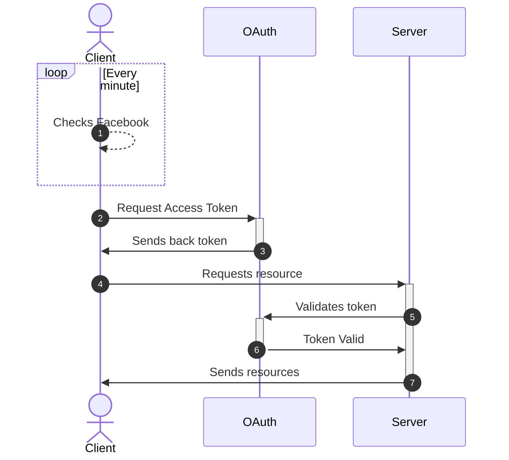

# Mermaid Example

```mermaid
sequenceDiagram
    autonumber
    actor Client
    participant OAuth
    links OAuth: { "Dashboard": "https://local.zackhankin.com", "AuthAPI": "https://authlocal.zackhankin.com"}
    participant Server
    link Server: Dashboard @ https://ares.local.zackhankin.com
    loop Every minute
        Client -->> Client: Checks Facebook
    end
    Client ->>+ OAuth: Request Access Token
    OAuth ->>- Client: Sends back token
    Client ->>+ Server: Requests resource
    Server ->>+ OAuth: Validates token
    OAuth ->>- Server: Token Valid
    Server ->>- Client: Sends resources
```
